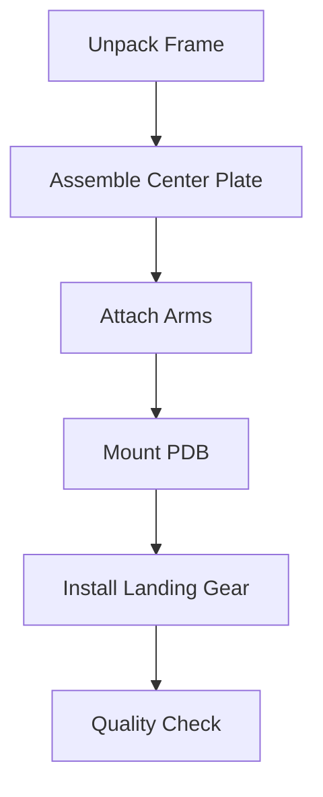

# Advanced DIY Quadcopter Build Guide 🚁

<div align="center">


[](https://github.com/yourusername/DIY-Quadcopter-Guide/commits/main)
[](https://github.com/yourusername/DIY-Quadcopter-Guide/issues)
[](https://github.com/yourusername/DIY-Quadcopter-Guide/stargazers)
[](https://github.com/yourusername/DIY-Quadcopter-Guide/network/members)
[](https://github.com/yourusername/DIY-Quadcopter-Guide/blob/main/LICENSE)

**A comprehensive guide to building an advanced quadcopter drone with deep insights into the physics and engineering principles.**

[Getting Started](#getting-started) •
[Components](#components) •
[Physics](#physics-principles) •
[Build Guide](#build-guide) •
[Documentation](https://yourusername.github.io/DIY-Quadcopter-Guide)

</div>

## 📚 Table of Contents

1. [Project Overview](#project-overview)
2. [Physics Principles](#physics-principles)
3. [Components & Requirements](#components--requirements)
4. [Pre-Build Calculations](#pre-build-calculations)
5. [Build Process](#build-process)
6. [Software Setup](#software-setup)
7. [Testing & Calibration](#testing--calibration)
8. [Flight Operations](#flight-operations)
9. [Safety Protocols](#safety-protocols)
10. [Troubleshooting](#troubleshooting)
11. [Advanced Modifications](#advanced-modifications)
12. [Contributing](#contributing)
13. [Support & Community](#support--community)

## 🎯 Project Overview

This project guides you through building a professional-grade quadcopter drone, emphasizing understanding the underlying physics and engineering principles. Perfect for hobbyists, students, and professionals interested in aerial robotics.

### Key Features
- Advanced flight control systems
- GPS-enabled autonomous capabilities
- Modular design for easy upgrades
- Real-time telemetry and data logging
- Custom PID tuning capabilities
- Optional FPV (First Person View) support

### Technical Specifications
```yaml
Frame Size: 450mm
Flight Time: ~15-20 minutes
Max Speed: 60 km/h
Control Range: 1-2 km
Maximum Payload: 500g
Total Weight: ~1200g
```

## 📐 Physics Principles

### Core Physics Concepts

#### 1. Thrust Dynamics
```math
T = CT × ρ × n² × D⁴

Where:
T = Thrust
CT = Thrust coefficient
ρ = Air density
n = Propeller rotational speed
D = Propeller diameter
```

#### 2. Power Requirements
```math
P = CP × ρ × n³ × D⁵

Where:
P = Power
CP = Power coefficient
```

#### 3. Flight Dynamics
The quadcopter operates on four fundamental movements:
- **Throttle**: Collective vertical motion
- **Roll**: Lateral rotation
- **Pitch**: Forward/backward rotation
- **Yaw**: Horizontal rotation

### Force Diagram

<svg viewBox="0 0 400 400" xmlns="http://www.w3.org/2000/svg">
    <!-- Center Frame -->
    <rect x="175" y="175" width="50" height="50" fill="#333"/>
    
    <!-- Motors and Force Vectors -->
    <circle cx="150" cy="150" r="20" fill="#666"/>
    <line x1="150" y1="150" x2="150" y2="100" stroke="blue" stroke-width="2"/>
    
    <circle cx="250" cy="150" r="20" fill="#666"/>
    <line x1="250" y1="150" x2="250" y2="100" stroke="blue" stroke-width="2"/>
    
    <circle cx="150" cy="250" r="20" fill="#666"/>
    <line x1="150" y1="250" x2="150" y2="300" stroke="blue" stroke-width="2"/>
    
    <circle cx="250" cy="250" r="20" fill="#666"/>
    <line x1="250" y1="250" x2="250" y2="300" stroke="blue" stroke-width="2"/>
    
    <!-- Force Labels -->
    <text x="130" y="90" fill="black">F1</text>
    <text x="230" y="90" fill="black">F2</text>
    <text x="130" y="320" fill="black">F3</text>
    <text x="230" y="320" fill="black">F4</text>
</svg>

## 🔧 Components & Requirements

### Essential Components List

#### Frame & Structure
- Main frame (450mm)
- Arms (4x)
- Hardware kit
- Landing gear
- Vibration dampeners

#### Propulsion System
- Brushless motors (4x)
  - KV rating: 920KV
  - Size: 2212-2312
- Propellers
  - Size: 10x4.5
  - Material: Carbon fiber
- ESCs
  - Current: 30A
  - Protocol: DShot600

#### Electronics
- Flight Controller
  - Processor: F7
  - IMU: MPU6000
- Power Distribution Board
- Battery
  - Type: 4S LiPo
  - Capacity: 3000mAh
  - C-Rating: 50C
- GPS Module
- Telemetry System

#### Control System
- RC Receiver
- Transmitter (minimum 6 channels)

### Tools Required
```plaintext
Essential:
- Soldering iron (40W minimum)
- Hex driver set (M2-M5)
- LiPo battery charger
- Multimeter
- Wire strippers/cutters

Optional:
- Oscilloscope
- Battery voltage tester
- Prop balancer
- Heat gun
```

## 🔬 Pre-Build Calculations

### Thrust-to-Weight Ratio (TWR)
```python
def calculate_twr(motor_thrust, components_weight, battery_weight):
    total_thrust = motor_thrust * 4  # Four motors
    total_weight = components_weight + battery_weight
    return total_thrust / total_weight

# Example
motor_thrust = 800  # grams
components_weight = 800  # grams
battery_weight = 400  # grams

twr = calculate_twr(motor_thrust, components_weight, battery_weight)
# Target TWR > 2.0 for good performance
```

### Power Budget
```python
def calculate_flight_time(battery_capacity, avg_current_draw):
    """
    battery_capacity in mAh
    avg_current_draw in A
    returns flight time in minutes
    """
    return (battery_capacity / 1000 * 0.8) / avg_current_draw * 60

# Example
battery_capacity = 3000  # mAh
avg_current_draw = 20  # A
flight_time = calculate_flight_time(battery_capacity, avg_current_draw)
```

## 🛠️ Build Process

### 1. Frame Assembly


### 2. Motor Installation
1. Identify CW and CCW motors
2. Mount motors on arms
3. Check motor rotation
4. Secure all connections

### 3. Electronic Setup
```plaintext
Wiring Sequence:
1. ESC signal wires → Flight Controller
2. Motor phase wires → ESCs
3. Power distribution connections
4. RC receiver setup
5. GPS module installation
6. Telemetry system integration
```

## 💻 Software Setup

### Flight Controller Configuration
```yaml
# Basic PID Configuration
pid_roll:
  P: 42
  I: 40
  D: 20

pid_pitch:
  P: 42
  I: 40
  D: 20

pid_yaw:
  P: 85
  I: 45
  D: 0
```

### Failsafe Settings
```plaintext
1. Radio Link Loss:
   - Hover for 15 seconds
   - Land if no signal recovery

2. Battery Critical:
   - Return to Home if possible
   - Controlled landing

3. GPS Loss:
   - Switch to altitude hold
   - Maintain position using optical flow
```

## 🎮 Flight Operations

### Pre-Flight Checklist
```markdown
1. Physical Inspection
   - [ ] Frame integrity
   - [ ] Propeller condition
   - [ ] Battery secure

2. Electronic Check
   - [ ] Battery voltage
   - [ ] Motor response
   - [ ] RC link quality
   - [ ] GPS lock

3. Environment Assessment
   - [ ] Weather conditions
   - [ ] Flying area clear
   - [ ] Legal requirements met
```

## ⚠️ Safety Protocols

### Emergency Procedures
1. Loss of Control
2. Battery Failure
3. Motor Failure
4. GPS Issues
5. Radio Interference

### Safety Equipment
- Fire extinguisher
- Safety glasses
- LiPo safe bag
- First aid kit

## 🔍 Troubleshooting

| Issue | Symptoms | Solutions |
|-------|----------|-----------|
| Flight Controller Issues | Erratic behavior | Calibrate sensors |
| Motor Problems | Vibration/noise | Check mounting/balance |
| Power Issues | Short flight time | Battery health check |
| Control Problems | Delayed response | Check RC settings |

## 🚀 Advanced Modifications

### Performance Upgrades
1. Improved ESCs
2. Higher KV motors
3. Lightweight frame components
4. Enhanced cooling system

### Feature Additions
1. FPV system
2. LED navigation lights
3. Camera gimbal
4. Payload release mechanism

## 👥 Contributing

We welcome contributions! Please read our [Contributing Guidelines](CONTRIBUTING.md) before submitting pull requests.

### Development Setup
```bash
# Clone repository
git clone https://github.com/yourusername/DIY-Quadcopter-Guide.git

# Install dependencies
cd DIY-Quadcopter-Guide
npm install

# Run tests
npm test
```

## 🌐 Support & Community

- [Discord Server](https://discord.gg/yourdiscord)
- [Forum](https://forum.yourdomain.com)
- [Wiki](https://github.com/yourusername/DIY-Quadcopter-Guide/wiki)
- [Issue Tracker](https://github.com/yourusername/DIY-Quadcopter-Guide/issues)

## 📜 License

This project is licensed under the MIT License - see the [LICENSE](LICENSE) file for details.

## 🙏 Acknowledgments

- Drone community contributors
- Open-source flight controller developers
- Testing and feedback providers

---

<div align="center">

**Made with ❤️ by [Your Name]**

[Back to Top](#advanced-diy-quadcopter-build-guide-)

</div>
