# Advanced DIY Quadcopter Project 🚁

<div align="center">


[](https://github.com/yourusername/DIY-Quadcopter)
[](LICENSE)

**A Complete Guide to Building Your Own Quadcopter with Physics-Based Understanding**

Created by: Md Khairul Islam  
Hobart and William Smith Colleges  
Double major in Robotics and Computer Science

[Core Physics](#physics-fundamentals) • 
[Components](#essential-components) • 
[Build Guide](#build-guide) • 
[Flight Control](#flight-control)

</div>

## 📚 Table of Contents
1. [Project Overview](#project-overview)
2. [Physics Fundamentals](#physics-fundamentals)
3. [Essential Components](#essential-components)
4. [Build Guide](#build-guide)
5. [Flight Control](#flight-control)
6. [Troubleshooting](#troubleshooting)
7. [Advanced Features](#advanced-features)

## 🎯 Project Overview

This project guides you through building a professional-grade quadcopter drone with a deep understanding of the physics and engineering principles involved. Unlike basic guides, we focus on understanding why each component works and how they interact.

### Key Features


## ⚡ Physics Fundamentals

### 1. Thrust Generation

```mermaid
graph TB
    subgraph "Thrust Generation"
        P[Propeller] --> F[Forces]
        
        subgraph "Physics Equations"
            T["T = CT × ρ × n² × D⁴"]
            P1["P = CP × ρ × n³ × D⁵"]
        end
        
        F --> L[Lift]
        F --> D[Drag]
        
        L --> T
        D --> P1
    end
```


### Key Physics Principles:
1. **Thrust Equation**
   ```
   T = CT × ρ × n² × D⁴
   Where:
   T = Thrust (N)
   CT = Thrust coefficient
   ρ = Air density (kg/m³)
   n = Propeller speed (rev/s)
   D = Propeller diameter (m)
   ```

2. **Power Requirements**
   ```
   P = CP × ρ × n³ × D⁵
   Where:
   P = Power (Watts)
   CP = Power coefficient
   ```

3. **Motor Dynamics**

```mermaid
graph LR
    subgraph "Motor Physics"
        V[Voltage Input] --> RPM[Motor Speed]
        RPM --> T[Thrust]
        
        KV[KV Rating] --> RPM
        
        subgraph "Relationships"
            R1["RPM = KV × Voltage"]
            R2["Thrust ∝ RPM²"]
        end
    end
```


### Flight Dynamics


## 🔧 Essential Components

### Frame Design


### Component List
1. **Frame (450mm)**
   - Carbon fiber construction
   - X configuration
   - Integrated power distribution

2. **Motors**
   ```
   Size: 2213
   KV Rating: 935
   Max Thrust: 850g/motor
   Operating Voltage: 11.1V-14.8V
   ```

3. **Electronic Speed Controllers (ESCs)**
   - 30A rating
   - BLHeli_S firmware
   - Active brake support

4. **Flight Controller**
   - F7 processor
   - MPU6000 gyroscope
   - Integrated PDB

[More components and their specifications...]

## 🛠️ Build Guide

### 1. Frame Assembly


[Detailed assembly steps...]

## 🎮 Flight Control

### PID Control System


[More control system details...]

[Would you like me to continue with the rest of the sections? There's still much more to cover including:
1. Detailed build steps
2. Flight control system
3. Safety protocols
4. Troubleshooting guide
5. Advanced features]
