# SR04Advanced Library 🎯

<div align="center">


[](https://github.com/yourusername/SR04Advanced)
[](https://www.arduino.cc/)
[](LICENSE)

**Advanced HC-SR04 Ultrasonic Sensor Library with Intelligent Filtering and Processing**

[Features](#features) • 
[Installation](#installation) • 
[Documentation](#documentation) • 
[Examples](#examples)

Created by: Md Khairul Islam  
Hobart and William Smith Colleges  
Double major in Robotics and Computer Science

</div>

## 📚 Table of Contents
1. [Overview](#overview)
2. [Features](#features)
3. [System Architecture](#system-architecture)
4. [Hardware Setup](#hardware-setup)
5. [Installation](#installation)
6. [Basic Usage](#basic-usage)
7. [Advanced Features](#advanced-features)
8. [Signal Processing](#signal-processing)
9. [Filter Types](#filter-types)
10. [Measurement Modes](#measurement-modes)
11. [Troubleshooting](#troubleshooting)
12. [API Reference](#api-reference)

## 🎯 Overview

The SR04Advanced library transforms standard HC-SR04 ultrasonic sensors into high-precision distance measurement systems through sophisticated signal processing and intelligent filtering algorithms.

### Key Innovations
- **Advanced Filtering System**: Multi-layer approach for optimal noise reduction
- **Smart Processing**: Adaptive algorithms that adjust to environmental conditions
- **Temperature Compensation**: Automatic adjustments for accurate measurements
- **Quality Metrics**: Real-time assessment of measurement reliability


### Performance Improvements
- Up to 95% noise reduction
- Enhanced accuracy through temperature compensation
- Automatic error detection and correction
- Real-time quality assessment

## ⚡ Features

### Signal Processing Pipeline


### Measurement Modes


## 🔧 Hardware Setup

### Connection Diagram


### Physical Connections
- VCC → Arduino 5V
- GND → Arduino GND
- TRIG → Digital Pin 9
- ECHO → Digital Pin 10

## 📥 Installation

### Arduino IDE
1. Download the library ZIP file
2. Arduino IDE → Sketch → Include Library → Add .ZIP Library
3. Select downloaded file

### PlatformIO
```ini
lib_deps =
    SR04Advanced
```

## 🚀 Basic Usage

```cpp
#include <SR04Advanced.h>

const int TRIGGER_PIN = 9;
const int ECHO_PIN = 10;

SR04Advanced sonar(TRIGGER_PIN, ECHO_PIN);

void setup() {
    Serial.begin(9600);
    sonar.begin();  // Auto-calibration enabled
}

void loop() {
    float distance = sonar.getSmartDistance();
    Serial.print("Distance: ");
    Serial.print(distance);
    Serial.println(" cm");
    delay(100);
}
```

## 🔬 Signal Processing

### Temperature Compensation

```mermaid
graph TB
    subgraph "Temperature System"
        T[Temperature] --> Calc[Speed Calculator]
        Calc --> Adjust[Distance Adjustment]
        
        subgraph "Calculations"
            F1["Speed = 331.3 + (0.606 × T°C)"]
            F2["Distance = Speed × Time ÷ 2"]
        end
    end
```


### Filter Performance


## 🔍 Troubleshooting


## 📘 API Reference

### Core Methods
```cpp
void begin(bool autoCalibrate = true)
float getDistance()
float getSmartDistance()
uint8_t getSignalQuality()
```

### Configuration
```cpp
void setFilterMode(uint8_t mode)
void setMeasurementMode(uint8_t mode)
void setTemperature(float temp_c)
```

## 🤝 Contributing

1. Fork the repository
2. Create feature branch
3. Commit changes
4. Push to branch
5. Open pull request

## 📝 License

This project is licensed under the MIT License - see the [LICENSE](LICENSE) file for details.

## 🌟 Support

For issues, questions, or contributions:
- Open an issue on GitHub
- Contact: [Your Email]

---

<div align="center">

Made with 💡 by Md Khairul Islam

</div>
